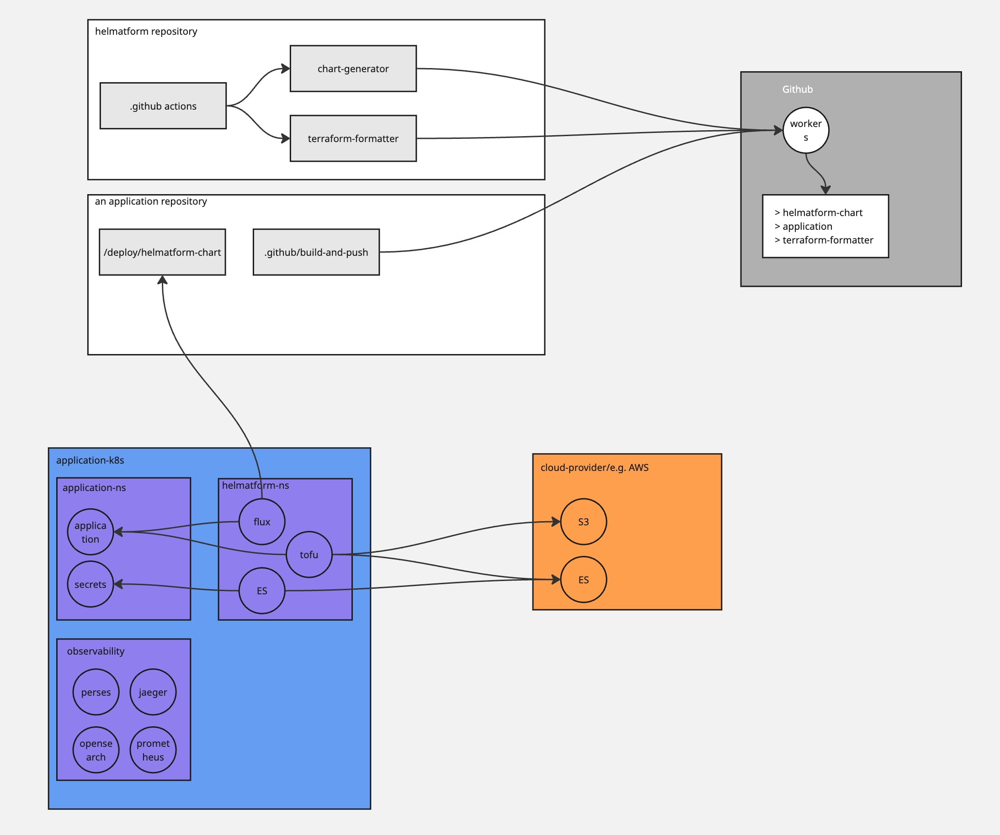

folder structure:

```
.github
	build helm
	build crd
charts
	base
resources
	s3
crds
	terraform-applier
init
	s3-terraform-backend
```

chart generator:

- creates a yaml file:

```
kind: folder_name
spec:
	var_name: {{values.s3.var_name}}
---
apiVersion: external-secrets.io/v1beta1
kind: ExternalSecret
metadata:
	name: s3-config
spec:
	target:
		name: {{CENTRAL_SECRET}}
		mode: append
	data:
		- secretKey: {{S3_EXTERNAL_SECRET}}
```

- create the value file:
  - read the base value file
  - append this to it:

```
folder_name:
	create: false
	var_name: empty_of_its_type
```

TODOs:
[ ] write the crd to apply helm - spec: - should apply the terraform - put the result somewhere - create a configmap containing outputs sensitive=false - create a secret containing outputs sensitive=true - questions: - should the crd spawn a job to apply to terraform? - where should we put the result of apply? in the events part?
[ ] setup minikube to install the crd
[ ] write s3 spec
[ ] write base helm chart
[ ] write helm chart builder
[ ] write a sample react app
[ ] deploy the app

---

```
tf-modules/s3:
s3.tf
output.tf --> writes output to external secret
---
helm generator creates an ExternalSecret yaml file, reading from this external secret and appending the secrets of this module to the central secret
```

Why?
- we need to import our current stack into this platform
- How can we make it easy for different companies to easily adapt it and customize it for themselves
- our developers needs to learn only yaml
- the yaml spec is well talked about in the company
- don't reinvent the wheel at all. Use any opensource tool that is possible

Dev environment:
- [Kind](https://kind.sigs.k8s.io/docs/user/quick-start/)

TODOs:
[X] s3 module: create a s3 and store credentials in an externalsecret
[X] setup the dev env ( minikube, aws creds )
[x] make tofu apply the helm in minikube (to learn what is the proper syntax for helm chart)
[x] move tofu runner into a separate namespace
	Tofu is now creating resources and creating the output secret in the correct namespace. But aws-cres is added to the application ns. It's not good. We should find a solution for it. (Maybe IRSA)
[] write helm chart generator
	write a python script to read tf-modules folder and create appropriate value file
[] clean up flux yaml file folders and main kustomization
[] use irsa instead of long lived aws tokens
